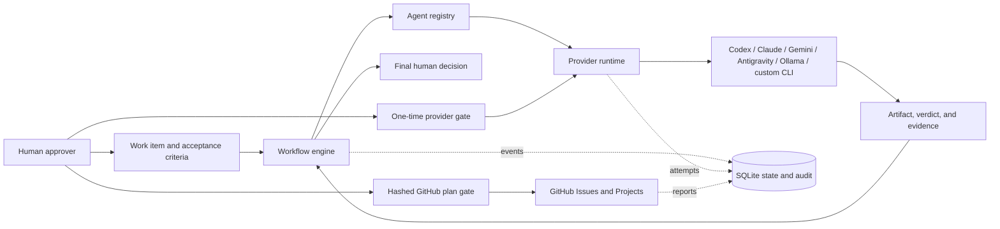

# Lokvetia Core

English · [Українська — концепція, архітектура й беклог](docs/evolution/README.md)

Development plan for both products: [unified order of 280 requirements](docs/evolution/implementation-order.en.md) · [first-release scope](docs/evolution/first-releases.en.md).

<p></p>

**AI teams. Human direction.**

**Product & architecture research:** [Self-improving Core and living worlds — concept, 65-item joint portfolio, evidence and delivery plan](docs/evolution/README.en.md) (proposed; documentation only).

[Lokvetia](https://lokvetia.com) · [Lokiravia game creation](https://github.com/HappyMiha/Lokiravia) · [Brand and migration](docs/brand/migration.md)

**Deployment monitoring:** [Deployment dashboard](docs/deploy-dashboard.html) · [Development progress page](docs/progress-dashboard.md) · [Automatic deployment and rollback](docs/autodeploy.md)

Formerly **AgentFactory Core**. Lokvetia is the family brand; **Lokiravia** is the separate game creation product. The domain is the brand address, not a claim that a hosted service has launched. Existing installations, Python imports, configuration and stored state remain compatible.

Coordinate specialist AI agents as one traceable, human-controlled delivery system.

Lokvetia Core is an open-source foundation for teams of AI agents. It turns a work item into a reviewable sequence of planning, coding, checks, and evidence across interchangeable providers. It records permissions, budgets, versions, and results so a person can understand and control the work.

The factory is project-neutral. Bring your own repository, requirements, roles, workflows, acceptance criteria, and provider accounts.

> **Alpha:** the deterministic simulation, guarded single-provider execution, local orchestration state, and dry-run GitHub planning are usable today. Full unattended multi-stage live execution, native HTTP providers, and a hosted control plane are not yet complete.

## Start locally

With Python 3.11+ and this repository checked out, activate a virtual environment and run:

```sh
python -m pip install -e ".[web]"
lokvetia --help
lokvetia --workspace . web --open
```

The local interface opens at `http://127.0.0.1:8765`. For the offline demonstration, run `lokvetia --workspace . demo`. Existing `agent-factory` commands remain supported and share the same data. See [installation instructions](docs/getting-started.md) and [compatibility](docs/brand/migration.md).

## Product family and scope

> **Planning update — 5 September 2026:** there are two projects. This repository remains the public, Apache-2.0 **Core**. [Lokiravia](https://github.com/HappyMiha/AgentFactory-Cloud) is a separate public repository for the commercial product plan: creating, playing, remixing, and publishing games. No Cloud application or game pipeline is claimed as delivered by this update.

**Contributing:** see the [development setup and checks](CONTRIBUTING.md).

Start with the simple English [Core and Cloud description](docs/core-cloud-boundaries.md), [roadmap](docs/core-cloud-roadmap.md), [backlog ownership](docs/core-cloud-backlog.md), and [audit summary](docs/product-audit-2026-09-05.md). The Cloud repository holds its [product description](https://github.com/HappyMiha/AgentFactory-Cloud/blob/main/docs/product-description.md), [roadmap](https://github.com/HappyMiha/AgentFactory-Cloud/blob/main/docs/roadmap.md), and [67-task backlog](https://github.com/HappyMiha/AgentFactory-Cloud/blob/main/docs/backlog.md).

The first product proof is a small Godot 2D game: idea → build → Play → feedback → version 2 → restore and source export, plus a private remix of an owned or licensed sample. The intended 12+ journey needs qualified age, account, privacy, and guardian controls before a minor pilot. More engines, local/hybrid models, public sharing, and commerce have separate gates.

The [Unreal and Gameplay AI plan](https://github.com/HappyMiha/AgentFactory-Cloud/blob/main/docs/unreal-gameplay-plan.md) adds a separate direction: Core coordinates the AI team, an optional adapter controls Unreal through an existing MCP backend, and a game-owned runtime supplies NPC memory and world behavior. Its first proof is one level, three NPCs and one objective, a Windows package played without the editor, save/load, an AI outage and a second accepted build after feedback.

The existing [43-task AF-GC manifest](examples/game-creator-backlog.json), [detailed English backlog](docs/game-creator-backlog.en.md) ([Українська](docs/game-creator-backlog.uk.md)), and older AF/AF-AMM IDs remain stable upstream references. A backlog entry or component test is not proof of the full creator journey.

## Why Lokvetia Core

- **Provider independence.** Replace a provider without rewriting the role or workflow.
- **Typed role contracts.** Versioned roles declare provider-neutral inputs, outputs, evidence, tools, permissions, limits, and incompatible duties; workflows reference roles rather than agents.
- **Fail-closed mission intake.** Normalized intent and source authority produce one machine-readable readiness verdict; ambiguity, conflicts, infeasibility, high risk, and reduced scope block Blueprint work until the human mission owner resolves them.
- **Evaluation-aware routing.** Pinned, best-qualified, cost, latency, diversity, canary, tournament, and fallback strategies use current qualification and record every eligible/excluded metric plus rationale.
- **Justified workforce composition.** Qualified role pools declare replica bounds, routing and arbitration; the composer globally enforces capability, independence, provider diversity, capacity, and budget with explicit gaps and fallbacks.
- **Signed Factory Blueprints.** Modules, workforce, tools, context, verification, budgets, policies, and recovery are traced to mission evidence; only the exact owner-signed latest version can authorize execution.
- **Recoverable mission bootstrap.** An authorized Blueprint digest creates one durable mission/workflow, exact manifests, and a pre-execution checkpoint; failed partial setup is transactionally rolled back and verified.
- **Evidence before progress.** Each stage returns a typed verdict and evidence for every acceptance criterion.
- **Two separate approval layers.** Permission to call a provider never means permission to accept the delivered work.
- **Safe-by-default execution.** Fixed executables and arguments, no shell, role allowlists, timeouts, output caps, and process-tree cleanup.
- **Fail-closed writable isolation.** Qualified OS sandbox backends restrict future writable workers to one task worktree and declared temporary paths, with network denied and teardown evidence preserved.
- **Lifecycle-aware runtimes.** Direct CLI and Hermes ACP execution share durable start/resume/heartbeat/cancel/event/finalize semantics without transferring Control Plane authority.
- **Control-Plane-owned worktrees.** Every writable task attempt receives one deterministic fenced Git branch/path; Autonomous Missions additionally receive preserved, checkpoint-rooted epoch branches/worktrees with immutable pre-mutation authority and fail-closed reconciliation.
- **Immutable dispatch context.** Every Worker Runtime launch is bound to a content-addressed, size-bounded package with explicit included, excluded, and superseded sources.
- **Governed context brokerage.** Role/purpose packages enforce provenance, freshness, and token limits while preserving authoritative requirements, safety constraints, decisions, unresolved risks, evidence, and next steps.
- **Typed memory and governed skills.** Eight separately queryable stores enforce scoped write/retrieval policy; invalidation preserves provenance and consumers, while reusable skills require curated test, security, and evaluation evidence.
- **Governed tool gateway.** Versioned tool schemas, side effects, risk, capabilities, limits, and evidence are enforced through mission/role/policy allowlist intersection; connector discovery never self-authorizes.
- **Zero-exposure credential brokerage.** Short-lived values stay in process memory, are bound to an exact scope, injected only at execution, recursively redacted, and revoked without entering prompts, logs, evidence, or audit.
- **Prompt-injection containment.** A maintained six-class hostile corpus drives deterministic tripwires, immutable incidents, quarantine, human-only release, and fail-closed admission to context, memory, artifacts, or execution.
- **Audited coordination patterns.** Parallel, generator-critic, quorum, debate, tournament, and red/blue work runs through bounded immutable contributions, model-independent reviewer rotation, deterministic arbitration, and dissent retention.
- **Transactional ADR governance.** Complete architecture decisions require an exact impact snapshot and human architecture-owner approval before one transaction versions the Blueprint, workflow contracts, and propagation evidence.
- **Signed extension packs.** Domain, capability, connector, policy, evaluation, and UI packs use canonical signed manifests, compatibility and qualification gates, approved trust roots, and reversible lifecycle state.
- **Software Engineering reference pack.** The proven worktree, worker, validator, independent review, candidate, and release contracts ship as one product-neutral pack with complete traceability and rollback evidence.
- **OpenTelemetry and cost accounting.** Correlation roots export unchanged with operational metrics, idempotent provider/estimated cost entries, deterministic threshold actions, and human-gated hard-budget expansion.
- **Tenant-scoped production storage boundary.** Object payloads are content-addressed and tenant-fenced with quota, governance policies, verified export, deletion evidence, and a PostgreSQL migration contract.
- **Versioned deployment profiles.** Single-node, clustered, hybrid, and air-gapped manifests declare security/egress defaults and require continuity evidence for upgrade and rollback.
- **Production qualification gate.** NFR thresholds, 10/25/100 capacity, accessibility, tenant isolation, and backup/restore evidence are retained immutably and fail closed when incomplete.
- **Chaos recovery evidence.** Clustered mutation-boundary faults and fresh-database restore exercises preserve identity continuity, accepted artifacts, and audit integrity.
- **Long-run soak gate.** A versioned 72-hour workload/fault schedule records bounded resource growth and rejects lost or duplicated authority, evidence, audit, or external-operation identities.
- **Reference acceptance mission.** A release envelope requires heterogeneous providers, independent verification, replacement/recovery/approval flow, and signed or human-excepted evidence for all 45 final criteria.
- **GA handover evidence.** Immutable runbook checklist, evidence index, restore/upgrade proof, and second-mission isolation gate define operational handover readiness.
- **Authenticated REST contract.** Versioned API resources expose bearer auth, tenant-scoped idempotency, ETags, signed webhooks, and SDK-compatible transport headers.
- **Human Control Plane.** Tenant-scoped human roles govern approvals, interventions, emergency stop, agent lifecycle, and irreversible retirement with immutable audit evidence.
- **Concrete Hermes ACP lifecycle.** A version-qualified stdio child is durably bound to the task/run/stage/attempt/worktree/context scope, with structured events, stable restart identity, permission bridging, and process-tree cancellation.
- **Qualified Hermes fallback boundary.** A durable ten-check matrix covers lifecycle, cancellation, confinement, tools, permissions, usage, and artifacts; failed Hermes workers can be quarantined, while direct fallback is read-only and pre-mutation only.
- **Exact live-stage approvals.** Mutable runtimes cannot start until the Control Plane consumes a stage/run/worker/runtime/worktree/permission-bound gate for one logical attempt; rejected, expired, or mismatched gates fail before process creation.
- **Writable Codex worker.** A qualified fixed `codex exec` profile writes only in its leased task worktree and returns immutable changed-file, diff, command, exit, and handoff evidence without merge, push, issue, or acceptance authority.
- **Writable Claude alternative.** A separately qualified Claude Code `stream-json` profile exposes only path-scoped file tools in the leased worktree; planning roles never enter this profile, and compatible Codex/Claude replacement preserves the task/workflow contract.
- **Deterministic candidate validation.** Project packs declare five shell-free command vectors that run only in the candidate worktree and produce bounded, criterion-mapped primary evidence.
- **Immutable candidate and PR plan.** Only a 5/5 validated worker diff becomes a stable-task-ID commit on its task branch; push and pull-request creation remain separately gated.
- **Independent criterion evaluation.** Model review starts only after deterministic validation, excludes the producing model, and records versioned evidence, confidence, concerns, and dissent for every required criterion.
- **Persistent bounded repair.** Every objective, plan, diff, validator/critic result, and budget delta survives restart; fixed limits pause the loop and repeated failures force replan or worker replacement.
- **End-to-end coding delivery.** Persisted implementation output advances through validation, independent review, bounded repair, a separate Founder gate, and a replay-safe PR-ready plan that never auto-merges.
- **Enforced execution budgets.** One correlation root retains duration, retries, tokens, estimated cost, tool calls, terminal reason, and linked runtime entities; stage preflight blocks work beyond token, cost, stage, retry, or tool caps.
- **Qualified local recovery.** Restart reconstructs stage, lease, session, context, worktree, and approval authority; provider, Hermes, and worktree orphans are reported separately without destructive cleanup.
- **Reviewable GitHub changes.** Mutations start as immutable, hashed plans and are dry-run by default.
- **Local-first state.** Work items, runs, artifacts, attempts, gates, and audit events live in a versioned SQLite database.
- **Offline demonstration.** The deterministic provider exercises the entire orchestration path without accounts, network access, or token spend.

## Component inventory

The status labels below describe earlier component delivery records. They do not certify an end-to-end live coding route, a supported game engine, a beginner-friendly creator interface, or a secure hosted service. Use the [current audit](docs/product-audit-2026-09-05.md) and the phase-specific acceptance gates when deciding what a product may claim.

For a quick start in Ukrainian, see the [Ukrainian user guide](docs/user-guide-uk.md) or the [PDF user guide](output/pdf/agent-factory-user-guide-uk.pdf).

| Capability | Status | Notes |
|---|---|---|
| Application services | Ready | Typed operator queries and guarded commands are shared by the CLI and Local Control Center. |
| Agent registry | Ready | List, enable, disable, and replace provider/model assignments. |
| Mission intake | Ready | AF-009 classifies immutable sources, records typed blocking gaps and permits Blueprint work only after an evidence-backed readiness verdict. |
| Workforce Composer | Ready | AF-012 emits immutable role pools and globally valid assignments; strengthened pools and reviewed diversity exceptions remain explicit. |
| Factory Blueprint | Ready | AF-013 validates the complete operating design, exact version/digest approval, and impact-analyzed immutable amendments. |
| Mission bootstrap | Ready | AF-014 instantiates one idempotent durable graph with seven manifests, rollback evidence, and an initial recovery checkpoint. |
| Context Broker | Ready | AF-015 records provenance/freshness and source outcomes, preserves mandatory authority, and compacts transcripts into immutable resumable state. |
| Typed memory | Ready | AF-016 provides eight bounded stores, historical invalidation, consumer traces, and evidence-gated skill approval/deprecation/revocation. |
| Tool Gateway and MCP lifecycle | Ready | AF-018 normalizes tool descriptors and invocation evidence, constrains dynamic discovery, and audits connector health and lifecycle. |
| Credential broker | Ready | AF-019 issues scoped expiring in-memory leases with human-gated expansion, injection firewall, zero-secret evidence, and audited revocation. |
| Prompt-injection defense | Ready | AF-021 continuously exercises six attack classes and links every containment to immutable tripwire, quarantine, incident, and red-team evidence. |
| Coordination patterns | Ready | AF-023 provides six bounded patterns with typed stored contributions, least-used independent reviewer rotation, deterministic outcomes, and replay-safe dissent evidence. |
| ADR governance | Ready | AF-022 records complete decisions and exact impact analysis, then atomically versions the Blueprint and affected workflow contracts or preserves prior authority. |
| Pack SDK and lifecycle | Ready | AF-024 verifies signed complete manifests, compatibility, permissions, dependencies, evaluations, and human-gated privilege before reversible install/upgrade/disable/rollback. |
| Software Engineering reference pack | Ready | AF-025 composes the existing delivery contracts, traces requirements through accepted review, and records reproducible dependency, security, and rollback evidence. |
| OpenTelemetry and cost ledger | Ready | AF-027 exports correlation-preserving traces, derives queue/run/failure/orphan metrics, records provider or estimated cost, and applies threshold actions. |
| Independent review routing | Ready | Rotating proxy-reviewer pools exclude producer models and persist every assignment. |
| Candidate evaluation | Ready | AF-020 enforces deterministic-first, model-independent, criterion-complete immutable verdicts. |
| Engineering loop | Ready | AF-008 persists complete iterations and enforces bounded progress and terminal-state rules. |
| Role definitions | Ready | AF-010 validates immutable typed role contracts, workflow role requirements, and per-decision duty separation. |
| Agent routing | Ready | AF-011 filters current compatible qualifications, preserves independent reviewer rotation, and records deterministic strategy/fallback decisions. |
| Software role pack | Ready | AF-054 installs eight typed delivery roles with duty separation and approved-candidate-only release authority. |
| Coding delivery loop | Ready | AF-053 joins the worker, validator, reviewer, Founder, and dry-run PR checkpoints without duplicate replay. |
| Execution telemetry | Ready | AF-056 correlates the single-node loop, enforces local budgets, and exposes operational state to the dashboard. |
| Local recovery | Ready | AF-057 restores authoritative references, detects separate orphan classes, and verifies evidence/audit integrity. |
| Hermes qualification | Ready | AF-047 persists the complete qualification matrix and gates read-only fallback or checkpointed new-lease runtime transfer. |
| Claude Code worker | Ready | AF-050 provides an independently qualified file-only writable implementation profile compatible with the shared Worker Runtime. |
| Workflow engine | Ready | Dependency validation, cycle detection, ordered stages, typed verdicts, and evidence checks. |
| Provider runtime | Guarded advisory | Deterministic, Codex, Claude, Gemini, Antigravity, Ollama, and Firecrawl adapters; every live call requires a one-use gate. |
| OpenClaw adapter | Health-only | Execution stays disabled until a dedicated no-tools profile is proven. |
| Human approval gates | Ready | Provider gates and durable live-stage gates are exact and one-use; final acceptance remains separate. |
| SQLite state and audit | Ready | Versioned migrations, WAL mode, integrity checks, backup support, and interrupted-attempt reconciliation. |
| Durable Control Plane core | AF-001–AF-007 complete | Normalized identities, transactional outbox/audit, criterion evidence, deterministic policy, adapter qualification, resumable checkpoints, and fenced scheduling. |
| GitHub Issues and Projects | Alpha | Reads and dry-run plans are ready; live allowlisted changes require a matching approval gate. |
| Docker | Profile boundary | The image runs as a non-root user with persistent `/data`; external provider CLIs are intentionally not bundled and deployment profiles document supported topology paths. |
| HTTP model APIs | Provider extension | DeepSeek, OpenRouter, Mistral, Groq, and similar services remain optional provider extensions; the guarded CLI/runtime boundary is the supported core contract. |
| Local Control Center | Complete (R0.2) | Loopback dashboard, guarded operations, Founder authority, audit/settings, GitHub dry-run preview, Windows launch, and end-to-end qualification are complete. |
| Autonomous Mission Mode | Bounded long-lived orchestration ready | The identifier-only parent revalidates exact approval, runs dependency-ready deterministic children, checkpoints accepted items, persists fenced controls and epoch handoffs, and rolls history into an immutable, discoverable continue-as-new chain only at safe boundaries. Typed operation journaling and actual-state recovery reconstruct revision, epoch, task, checkpoint, Git authority, model lease, and services without replaying accepted mutations. Git checkpoint materialization, revision-impact restart transactions, and complete coding-worker slices remain in progress. |

## How it works



## Local demo

The demo is deterministic. It does not invoke an external model or mutate GitHub.

The Local Control Center can be installed and opened on Windows with `python -m pip install -e ".[web]"; if ($LASTEXITCODE -eq 0) { python -m agent_factory --workspace . web --open }`. It binds to `127.0.0.1:8765`; press `Ctrl+C` to stop it and see [Local Control Center](docs/local-control-center.md).

## Durable workflows with Temporal

For the commercial product, the recommendation is to retain Temporal for durable development jobs and keep it outside the first shipped game's NPC loop. The [commercial-use and architecture review](docs/architecture/temporal-commercial-decision.md) explains the MIT licenses, self-hosted versus managed service, current dependency and replacement tradeoffs.

Temporal can durably orchestrate Lokvetia Core delivery runs while the Worker remains on the Windows host with access to the existing local CLI and project environment. Start the loopback-only PostgreSQL-backed development stack with `.\infra\temporal\start.ps1`, enable it with `$env:TEMPORAL_ENABLED = "true"`, then run the Local Control Center and `agent-factory-temporal-worker` in separate PowerShell windows. Autonomous parents continue as new at configured safe boundaries; typed Search Attributes and memo identify every retained run, while the immutable SQLite run ledger remains authoritative after the default seven-day Temporal retention window. Normal stops preserve Workflow history; only `reset.ps1` deletes the named database volume.

See [Temporal development](docs/development/temporal.md) for setup and troubleshooting, and [Temporal Worker versioning](docs/development/temporal-worker-versioning.md) for the required patch, replay, deployment, and rollback procedure. The current architecture and migration boundaries are recorded in [the integration analysis](docs/architecture/temporal-integration-analysis.md).

### Windows PowerShell

```powershell
winget install --id Git.Git --exact --source winget
winget install --id Python.Python.3.12 --exact --source winget
# Close and reopen PowerShell after first-time installs, then continue:
git --version
py -3.12 --version
git clone <repository-url> AgentFactory
Set-Location AgentFactory
py -3.12 -m venv .venv
& .\.venv\Scripts\python.exe -m pip install --upgrade pip
& .\.venv\Scripts\python.exe -m pip install -e .
& .\.venv\Scripts\agent-factory.exe env check
& .\.venv\Scripts\agent-factory.exe demo
```

Replace `<repository-url>` with the clone URL supplied by the publisher. If Git and Python 3.11+ are already installed, skip the two `winget install` commands. For a private repository, authenticate with its hosting service first; never embed an access token in the clone URL.

### macOS or Linux

```bash
git clone <repository-url> AgentFactory
cd AgentFactory
python3.11 -m venv .venv
.venv/bin/python -m pip install --upgrade pip
.venv/bin/python -m pip install -e .
.venv/bin/agent-factory env check
.venv/bin/agent-factory demo
```

Replace `<repository-url>` with the clone URL supplied by the publisher. Activating the virtual environment is optional; these examples invoke its entry point directly.

Later examples shorten the command to `agent-factory`. Without activation, substitute `& .\.venv\Scripts\agent-factory.exe` on Windows PowerShell or `.venv/bin/agent-factory` on macOS and Linux.

## Docker demo

Docker intentionally runs simulation mode by default.

```bash
docker compose build
docker compose run --rm agent-factory demo
```

State persists in the named `agent-factory-data` volume. The container is read-only apart from `/data` and temporary storage. To use real provider CLIs, run Lokvetia Core on the host or build a private image that installs and authenticates each required CLI.

## First project and work item

```bash
agent-factory project init --name "Example Product" --description "A small, measurable delivery"
agent-factory project list
agent-factory work-item create --project-id 1 --title "First capability" --description "Deliver one independently reviewable capability" --kind task --acceptance "Criterion one" --acceptance "Criterion two"
agent-factory work-item list --project-id 1
```

You can also validate and import a structured backlog:

```bash
agent-factory backlog validate --path examples/backlog.json
agent-factory backlog import --path examples/backlog.json --project-id 1
agent-factory backlog sync --path examples/backlog.json --repo OWNER/REPOSITORY
```

Use `agent-factory <command> --help` before automation; alpha command flags may evolve before version 1.0.

## Run one real provider safely

First install and authenticate the provider CLI, then confirm discovery:

```bash
agent-factory providers status
agent-factory agents list
```

Request a gate for exactly one provider, agent, and work item:

```bash
agent-factory providers request ollama --agent coding-worker-ollama --task-id 1
agent-factory providers gates
agent-factory providers approve 1 --note "One bounded local artifact"
agent-factory providers invoke 1
```

An approved gate is consumed by one logical attempt, including failed or interrupted attempts. A retry requires a new gate. Provider output remains advisory.

Final workflow acceptance is separate:

```bash
agent-factory approvals list
agent-factory approvals approve 1 --note "Evidence reviewed"
```

## Provider overview

| Provider ID | Execution mode | Intended use |
|---|---|---|
| `deterministic` | Offline simulation | Installation checks, workflow development, CI, and demonstrations. |
| `codex` | Read-only sandbox | Implementation proposals, technical analysis, and validation. |
| `claude` | Plan mode | Planning, rotating proxy review, decomposition, and independent judgment. |
| `gemini` | Plan mode | Alternative planning, review, and implementation proposals. |
| `antigravity` | Plan mode plus OS sandbox | Non-interactive implementation proposals, planning, and independent review. |
| `ollama` | Local, no tools | Private local artifacts and low-cost review. |
| `openclaw` | Disabled | Health probe only until a no-tools execution profile is available. |
| `firecrawl` | Read-only web research | Bounded public-web evidence gathering by the dedicated `Web Researcher` role. |

Antigravity CLI 1.1.9 requires its non-interactive prompt as a process argument. Lokvetia Core excludes that prompt from retained command metadata, but local process inspection may still see it while the provider runs. Use Antigravity only for non-secret work-item content.

The Firecrawl adapter has no project-reading or code-writing permission. It runs `firecrawl agent` with a five-credit ceiling, requires a one-use provider gate, and returns web evidence as an untrusted artifact for human or independent-agent review.

Provider authentication belongs to each CLI's own profile or operating-system keyring. Never put credentials in work-item or provider prompts. Lokvetia Core applies scoped credential injection and recursive redaction at governed execution boundaries; generic provider output still requires review before external publication. See [Provider setup](docs/providers.md).

## CLI map

```text
agent-factory env check
agent-factory project init | list
agent-factory work-item create | list
agent-factory agents list | enable | disable | replace
agent-factory backlog validate | import | sync | gates | approve | reject
agent-factory providers status | request | gates | approve | reject | invoke
agent-factory task claim | run | review
agent-factory reviews list [--run-id RUN_ID]
agent-factory workflow run
agent-factory approvals list | approve | reject
agent-factory audit list
agent-factory state check | backup | stale
agent-factory demo
```

## Safety model

Lokvetia Core treats every provider response and imported backlog as untrusted input.

- Real providers cannot run without a matching one-time human gate.
- Provider commands use fixed configuration, `shell=false`, a repository-scoped working directory, and bounded execution.
- An agent role must appear in the provider's allowlist.
- Simulation artifacts are explicitly labeled and never masquerade as live evidence.
- GitHub operations are dry-run by default and restricted to an allowlist.
- Automatic merging, closing, deletion, and final approval are not supported.
- Reviewer routing excludes all producer model identities declared by `review_of`; a reviewer verdict cannot grant final acceptance.
- Every important transition is recorded in the local audit stream.
- Every provider approval stores immutable request and definition digests; task, agent, provider, or policy drift invalidates the gate before a subprocess starts.

This is defense in depth, not a complete security boundary. Read the [security policy](SECURITY.md) and [architecture](docs/architecture.md) before enabling real providers.

## Configuration

Shipped defaults are package resources. Override them by pointing `AGENT_FACTORY_CONFIG_DIR` at a directory containing reviewed configuration files. Set `AGENT_FACTORY_WORKSPACE` to the repository providers may inspect and `AGENT_FACTORY_DB` to the SQLite path.

The configuration format is JSON-compatible YAML: valid JSON stored with a `.yaml` or `.json` suffix. This keeps the core runtime dependency-free.

See:

- [Getting started](docs/getting-started.md)
- [Режим «AI-студія»: від ідеї до гри без ручних воріт](docs/ai-studio.uk.md)
- [Налаштування без редагування файлів](docs/settings.md)
- [Accessibility judged on the rendered page](docs/accessibility-audit.md)
- [Two languages, or the catalogue is wrong](docs/localisation.md)
- [What is happening, and what a stop would stop](docs/work-status.md)
- ["Make the jump higher" — feedback that becomes the next version](docs/game-feedback.md)
- [Architecture](docs/architecture.md)
- [Development roadmap](docs/development-roadmap.md)
- [Active game-creator backlog (12+)](docs/game-creator-backlog.uk.md) and [product audit (2026-09-05)](docs/product-audit-2026-09-05.uk.md)
- [Autonomous Mission Mode review](docs/autonomous-mission-mode-review.md), [planning intake contract](docs/autonomous-mission-planning.md), [epoch worktree runbook](docs/development/mission-epoch-worktrees.md), and [implementation backlog](examples/autonomous-mission-backlog.json)
- [Implementation audit (2026-08-11)](docs/implementation-audit-2026-08-11.md)
- [Implementation release notes (2026-08-11)](docs/release-notes-2026-08-11.md)
- [Godot 2D game pack and engine adapter](docs/godot-pack.md)
- [Support levels and honest scoping](docs/capability-levels.md)
- [Unity setup and build adapter](docs/unity-setup.md)
- [Latest verified playable version](docs/playable-versions.md)
- [Asset provenance and safe import](docs/asset-provenance.md)
- [Export and sharing](docs/export-and-share.md)
- [Support bundles](docs/support-bundle.md)
- [Updates and uninstall](docs/updates-and-uninstall.md)
- [Providers](docs/providers.md)
- [Workflows](docs/workflows.md)
- [GitHub integration](docs/github-integration.md)
- [Operations](docs/operations.md)

## Extending the factory

- Add a CLI provider through reviewed configuration when its command can be fixed and non-interactive.
- Add an agent by assigning an ID, role, provider, instructions, and permissions.
- Add a workflow by composing typed, dependency-aware stages.
- Add a new provider transport by implementing the provider interface and its health and execution contracts.
- Select and qualify a concrete PostgreSQL/object-store deployment driver behind the AF-029 repository boundary; the local contract and migration evidence are implemented, but no driver is bundled.
- Extend GitHub mutations only by adding a narrowly defined action plus negative and idempotency tests.

## Development

```bash
python -m pip install -e ".[web,dev]"
python -m unittest discover -s tests -v
python -m compileall -q src tests
python -m pip install build
python -m build
```

The repository CI runs Python 3.11 and 3.12 tests on Windows, Ubuntu, and macOS, builds a wheel, tests a clean installation outside the checkout, and builds the Docker image. CI validates deterministic execution and adapter/configuration portability; it does not authenticate providers or run live provider canaries.

## Alpha limitations

- Multi-stage live workflows still require explicit approval handling for every real provider call.
- Provider output limits are enforced on the retained artifact; streaming byte limits remain a provider-runtime hardening follow-up.
- Sensitive environment names and governed credential values are redacted at the execution/evidence boundary; generic third-party output still needs review before publication.
- Windows cleanup uses a contained process group and targeted tree termination, not a Job Object.
- SQLite is the only state backend.
- External provider CLIs and their subscriptions are installed, authenticated, billed, and updated independently.
- The Docker image is intended for simulation and control-plane evaluation, not host CLI passthrough.

## Contributing and licensing

Read [CONTRIBUTING.md](CONTRIBUTING.md) before opening a pull request. Security reports belong in private GitHub Security Advisories as described in [SECURITY.md](SECURITY.md).

Copyright 2026 HappyMiha. Lokvetia Core is licensed under the [Apache License 2.0](LICENSE).
